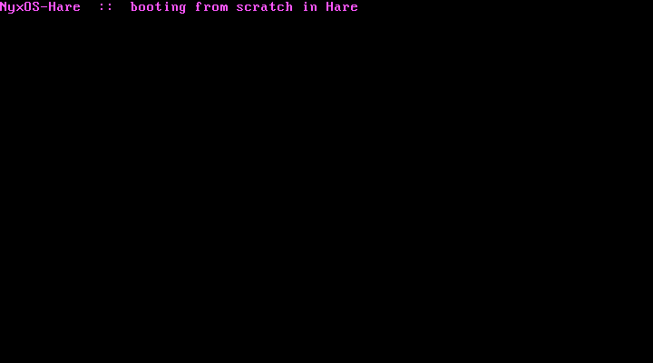

<div align="center">
  
</div>

<p align="center"><strong>NyxOS, rebuilt from scratch in Hare — a freestanding 64-bit kernel that boots on bare metal</strong></p>

<p align="center">
  
  &nbsp;
  
  &nbsp;
  
  &nbsp;
  <a href="https://github.com/nyxos-dev/nyx-os"></a>
</p>

---

## About

Part of the **[NyxOS](https://github.com/nyxos-dev/nyx-os) family** — the same OS, rebuilt from zero in a different language each time. This is the **Hare** cut, built with `hare build -t o` into a bare object — no `rt` startup, no libc. A Multiboot stub enters **long mode** and calls the exported `kmain`, which writes its banner straight to VGA text memory.

<div align="center">
  
  <p><em>NyxOS-Hare booting in QEMU (GRUB → long mode → Hare) on the VGA text buffer</em></p>
</div>

**Why Hare:** small, freestanding, systems-focused, with a tiny runtime you can stand in for. Proven in the wild by a handful of bare-metal experiments.

## Build & run

Needs `hare`, `nasm`, `as`, `ld`, `grub-mkrescue`, and `qemu`.

```bash
make        # -> nyxos-hare.iso  (64-bit ELF booted via GRUB)
make run    # boot the ISO in QEMU
```

## Layout

- `boot64.asm` — Multiboot header + the 32-bit → long-mode trampoline that calls `kmain`
- `kernel.ha` — the freestanding Hare kernel (VGA console)
- `stubs.s` — the one `rt` symbol a bare object references (`rt.abort_fixed`)
- `linker64.ld` / `grub.cfg` / `Makefile` — link, package, boot

## Status

Early — it boots and paints the screen. Next up: a GDT/IDT, interrupts, and a VGA console module.
